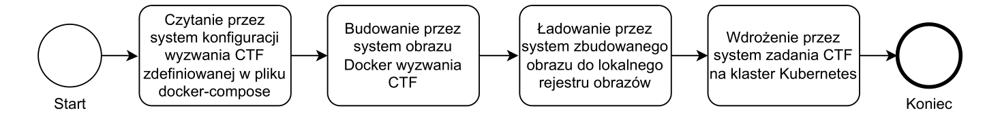
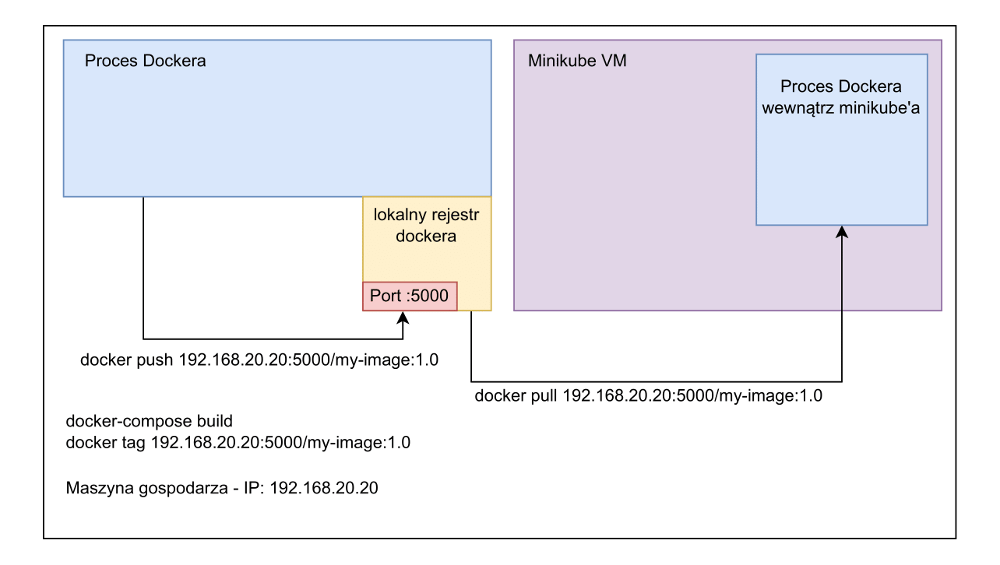
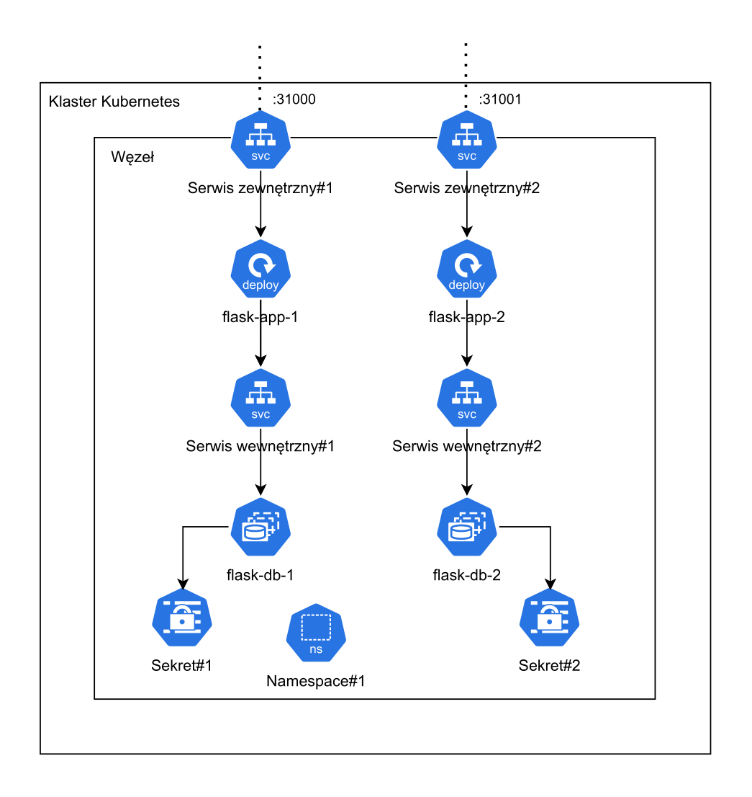

# CiTiFier

System for deploying CTF challenges. The goal is to automate the stages of challenge
deployment, from retrieving challenges from a GitHub repository, through building Docker application images, loading it into local image registry and
deploy them in a Kubernetes cluster.

## Technology stack

- Java
- Spring Boot
- Thymeleaf
- Htmx
- Postgres
- Docker
- Kubernetes

## Example setup Run

This is only example. You can run local registry with secure connection. Other Kubernetes clusters are also compatible with CiTiFier.

Run local image registry(example):

```
docker run -d -p 5000:5000 --name registry registry:2
```

Run Kubernetes cluster (minikube example with insecure registry):

```
minikube start --insecure-registry="$HOST_IP:5000"
```

If you run app with insecure-flag you need remember to add $HOST_IP:$PORT to "insecure-registry" config in docker (in linux - /etc/docker/daemon.json).

## Run app

Run database:

```
docker run --name postgres -e POSTGRES_PASSWORD=postgres -e POSTGRES_DB=pg -p 5432:5432 -d postgres:latest
```

Run app:

```
./gradlew bootRun
```

On windows, you can run app with script (remember to config insecure-registry add fullfill configuration):

```
./start.ps1
```

## Configuration

System allows to customize some configuration.

System allows to download private repository from Github. In order to do so, you need to create Github App and setup secrets from created app in system:

- GITHUB_CLIENT_ID
- GITHUB_CLIENT_SECRET
- GITHUB_APP_ID

If you are on Linux/macOS you need to setup process shell:
Default(for Windows):

- PROCESS_SHELL=powershell.exe
- PROCESS_CONFIG=-Command

Setup base clone repository path:

- REPO_CLONE_PATH

In order to make image pull available from Kubernetes cluster, you need to provide your host machine IP to cluster and CiTiFier:

- DOCKER_HOST_IP_ADDRESS=$HOST_IP

Example of all configurations are included in script.ps1.

## Architecture

Busissnes process:



Building image from docker-compose, tagging and pushing to local image registry:



Deployed CTF challenge (two instances):


